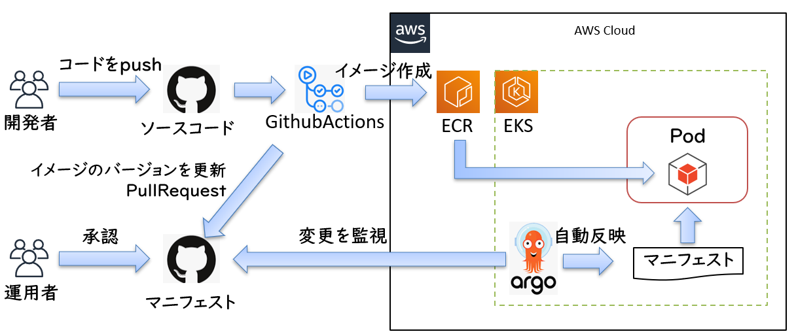

# CI/CD

GithubActionsとArgoCDを用いたGitOps環境を構築する

## 全体像



## CI環境の準備

### GtihubActions

GitHubに統合されたCI/CDサービス。

GitHub上で管理しているコードを自動でビルド・テスト・デプロイを行うことができる。nautibleではCIツールとして利用している。（デプロイは後述のArgoCDを利用）

[GithubActionsのセットアップ手順](./docs/githubactions.md)

## CD環境の準備

### ArgoCD

Kubernetesのための宣言型デリバリーツール。

Kubernetes内からGitリポジトリおよび実行環境を監視することで常に実行環境をGitリポジトリと同じ状態に保つように動作する。

[ArgoCDのセットアップ手順](./docs/argocd.md)

## 導入手順

### エコシステムのデプロイ

nautibleで利用するエコシステムを定義したApplicationリソースをデプロイする

AWSの場合

```
$ kubectl apply -f ArgoCD/ecosystems/overlays/aws/dev/application.yaml
```

Azureの場合

```
$ kubectl apply -f ArgoCD/ecosystems/overlays/azure/dev/application.yaml
```

### シークレットのデプロイ

サンプルアプリケーションで利用するExternalSecretsを定義したApplicationリソースをデプロイする

事前にSystemManager（AWSの場合）、AzureKeyVault（Azureの場合）にシークレットを定義しておく

AWSの場合

```
$ kubectl apply -f ArgoCD/secrets/overlays/aws/application.yaml
```
Azureの場合

```
$ kubectl apply -f ArgoCD/secrets/overlays/azure/application.yaml
```

### サンプルアプリケーションのデプロイ

サンプルアプリケーションを定義したApplicationリソースをデプロイする

事前にGithubActionsのCIが正常に完了していること

AWSの場合

```
$ kubectl apply -f ArgoCD/applications/overlays/aws/application.yaml
```

Azureの場合

```
$ kubectl apply -f ArgoCD/applications/overlays/azure/application.yaml
```

## （参考）AWSマネージドサービスを活用したCI/CD構成

AWSマネージドサービスを活用したCI/CDは[こちら](https://github.com/nautible/nautible-infra-codebuild)を参照。