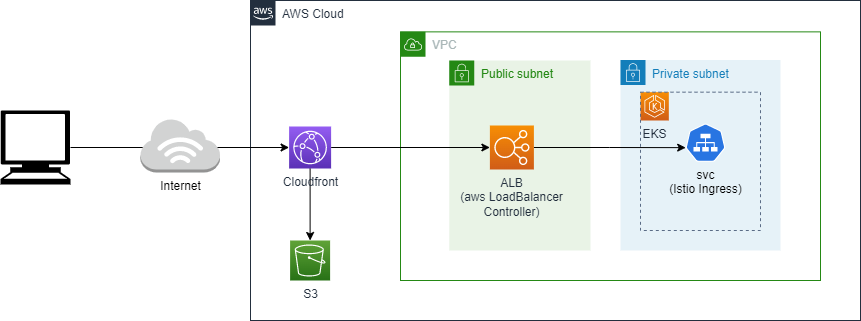

# platform

## Terraform

VPCやSubnetなど開発の基礎となるAWSリソースを管理する

### Terraform構成

```text
platform
  │  main.tf      ・・・リソース定義の全量を定義する(全moduleの実行定義)
  │  variables.tf
  │
  ├─env     ・・・環境毎のディレクトリ。基本的にvariablesに定義する値だけ環境毎に変えることでコントロールする。
  │  ├─dev
  │  │   │  main.tf
  │  │   │  variables.tf　・・・開発用の設定値
  │  └─prod
  │      │  main.tf
  │      │  variables.tf　・・・本番用の設定値
  │
  └─modules　　・・・各種リソースのまとまりでmodule化
      ├─cloudfront       ・・・cloudfront関連のリソースのmodule
      ├─eks              ・・・eks関連のリソースのmodule
      ├─eks-pod-identity ・・・EKS Pod Identityで付与するIAMロール/ポリシー
      ├─init             ・・・このTerraformリソース全体の初期化用のmodule。tfstate管理のS3バケット作成など。
      ├─oidc             ・・・OpenIDConnectの利用に必要となるmodule
      ├─route53          ・・・route53関連のリソースのmodule
      ├─tool             ・・・ツール類
      └─vpc              ・・・vpc関連のリソースのmodule

AWS-S3
  │
  └─nautible-dev-platform-tf-ap-northeast-1 ・・・Terraformを管理するためのS3バケット。バージョニング有効。
        │   nautible-dev-platform.tfstate   ・・・Terraformのtfstate
AWS-Dynamodb
  │
  └─nautible-dev-platform-tfstate-lock
              ・・・teffaromのtfstateのlockテーブル
```

※各module配下のファイルは記載を割愛

### 環境構築対象の主なリソース

* VPC、Subnet、IGWなどAWSネットワークの基礎リソース
* EKSクラスター、FargeteプロファイルなどAWSのマネージドなk8sリソース
* Cloudfront、s3など静的コンテンツなどを配信するためのAWSリソース
* IAM ロール、ユーザーなどAWSIAMリソース  


※より詳細なリソース情報については「terraform plan」にて確認してください

### 環境構築の前に

* AWS環境の環境構築のみサポートしています
* Terraformを利用して環境構築を行います
* TerraformのAWS認証は環境変数「AWS_PROFILE」でプロファイルを利用して実行することを想定しています（Terraformの定義ファイルを編集する事で他の方法でも認証可能ですが、SCMへのコミットミスなどに注意が必要です）
* このTerraformの定義で構築するAWS環境はnautibleを簡単に試したり、開発環境として利用する事を想定しています。本番環境として利用するためには、各プロジェクトの特性に合わせて環境設定や作成するリソースを検討してください。以下は検討内容の例です。
  * WAFの作成
  * EKSのノード数の定義
  * NAT-GATEWAYの利用検討（費用の観点からデフォルトでNAT-INSTANCEを利用するように設定している）
  * セキュリティグループの見直し
  * CloudTrailの利用検討
  * 各種AWSのログの配置やアーカイブなど

### 環境構築実行環境事前準備

* [Terraform(cli)のインストール](https://learn.hashicorp.com/tutorials/terraform/install-cli)
* AWSアカウントの作成
* [AWS cliのインストール](https://docs.aws.amazon.com/ja_jp/cli/latest/userguide/cli-chap-install.html)
* AWS接続要の[cliプロファイル作成](https://docs.aws.amazon.com/ja_jp/cli/latest/userguide/cli-configure-profiles.html)

### 環境構築手順

<!-- #### 独自ドメインを利用しない場合
すぐに試してみたい場合はこちら。 -->

* AWSの接続プロファイルを環境変数に設定する「export AWS_PROFILE=profile_name」
* tfstate管理用のS3バケットの作成（管理者が一度だけ実行。Terraformで作成するのはアンチパターンですが、nautibleを簡単に試せるようにするため用意しています）
  * platform/modules/initのmain.tfとvariables.tfをファイル内のコメントを参考に用途にあわせて修正
  * platform/modules/initディレクトリで「terraform init」の実行
  * platform/modules/initディレクトリで「terraform plan」の実行と内容の確認
  * platform/modules/initディレクトリで「terraform apply」の実行
* AWS環境の構築
  * platform/env/devのmain.tfとvariables.tfをファイル内のコメントを参考に用途にあわせて修正
  * platform/env/devディレクトリで「terraform init -backend-config="bucket=<initで作成したバケット名>"」の実行
  * platform/env/devディレクトリで「terraform plan」の実行と内容の確認
  * platform/env/devディレクトリで「terraform apply」の実行
  * IstioのIngressgatewayのロードバランサー作成後に、platform/env/devのvariables.tfにロードバランサーのnameを指定してapplyを再実行(cloudfrontが追加されます)。

※prodの場合はplatform/env/devをprodに読み替えてください。

### terraformのGitOpsとGithub Actionsについて

|  作業No  |  ブランチ  |  作業内容  |  GAトリガー  |  GAで実行するTerraformコマンド  | 備考 |
| ---- | ---- |---- |---- | ---- |---- |
|  １  |  開発ブランチ  | 開発 | - | - |  |
|  ２  |  開発ブランチ＞mainブランチ  | プルリクエスト作成 | プルリクエスト | terraform plan | terraform planにより差分など確認できる |
|  ３  |  mainブランチ  | プルリクエストのマージ | マージコミット | terraform apply --auto-approve | PRの検証にはNo２のterraform planの結果を参考にする |

※GA＝GithubActions

上記のフローについてはあくまでもサンプルであり、各プロジェクトの要件に合わせて以下のような点を考慮し、カスタマイズして利用検討すること

* 構成管理や開発体制に合わせてブランチ運用やフローを検討する
* 開発、ステージング、本番など各種環境によっても適用の是非やフローを検討する
* 必要に応じてTerratestなど、自動化テストや要件に合わせた各種テストなどを組み込むことを検討する
* GitHub Actionから環境構築を行っているためGithub Secretsに権限の強いAWSユーザーを設定している。要件によっては、GitHubをトリガーに実環境側の仕組み（AWS Code XXXなど）を利用してTerraformを実行することなども検討する
