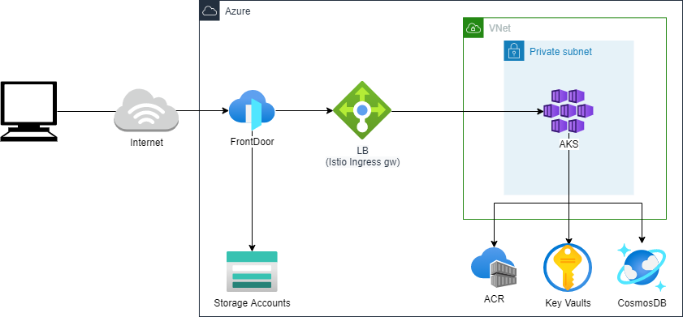

# plattoform

## Terraform

vnetやsubnetなど開発の基礎となるAzureリソースを管理する

### Terraform構成

```text
platform
  │  main.tf      ・・・リソース定義の全量を定義する(全moduleの実行定義
  │  variables.tf
  │
  ├─env     ・・・環境毎のディレクトリ。基本的にvariablesに定義する値だけ環境毎に変えることでコントロールする。
  │  ├─dev
  │  │   │  main.tf
  │  │   │  variables.tf　・・・開発用の設定値
  │  └─prod
  │      │  main.tf
  │      │  variables.tf　・・・本番用の設定値
  │
  └─modules　　・・・各種リソースのまとまりでmodule化
      ├─acr           ・・・cloudfron関連のリソースのmodule
      ├─aks           ・・・aks関連のリソースのmodule
      ├─app           ・・・applicaiton関連のリソースのmodule
      ├─frontdoor     ・・・frontdoor関連のリソースのmodule
      ├─init          ・・・このTerraformリソース全体の初期化用のmodule。tfstate管理のStorage Account作成など。
      ├─keyvault      ・・・keyvault関連のリソースのmodule
      ├─staticweb     ・・staticweb関連のリソースのmodule
      └─vnet          ・・・vnet関連のリソースのmodule

Azure-StorageAccount
  │
  └─${pjname}terraformsa          ・・・Terraformを管理するためのstorageaccount。
        │   
        └─${pjname}terraformcontainer     ・・・Terraformのtfstateを管理するためのコンテナ
              │
              └─{pjname}platform.tfstate     ・・・Terraformのtfstate
```

※各module配下のファイルは記載を割愛

### 環境構築対象の主なリソース

* vnet、subnetなどネットワークの基礎リソース
* aksクラスターなどazureのマネージドなk8sリソース
* storageaccountなど静的コンテンツなどを配信するためのリソース
* keyvaultなどsecretsを管理するためのリソース
* frontdoorなどトラフィック管理、静的コンテンツの配信のためリソース


※より詳細なリソース情報については「terraform plan」にて確認してください

### 環境構築の前に

* Terraformを利用して環境構築を行います
* TerraformのAzure認証は事前にaz loginしている事を前提としています
Terraformの定義ファイルを編集する事で他の方法でも認証可能ですが、SCMへのコミットミスなどに注意が必要です
* このTerraformの定義で構築するAzure環境はnautibleを簡単に試したり、開発環境として利用する事を想定しています。本番環境として利用するためには、各プロジェクトの特性に合わせて環境設定や作成するリソースを検討してください。以下は検討内容の例です。
  * WAFの作成
  * AKSのノード数の定義
  * 各種Azureのログの配置やアーカイブなど

### 環境構築実行環境事前準備

* [Terraform(cli)のインストール](https://learn.hashicorp.com/tutorials/terraform/install-cli)
* Azureアカウントの作成
* [Azure cliのインストール](https://docs.microsoft.com/ja-jp/cli/azure/install-azure-cli)

### 環境構築手順

* 「az login」を実行してAzureにログインする
* tfstate管理用のstorageaccountの作成（管理者が一度だけ実行。Terraformで作成するのはアンチパターンですが、nautibleを簡単に試せるようにするため用意しています）
  * platform/modules/initのmain.tfとvariables.tfをファイル内のコメントを参考に用途にあわせて修正
  * platform/modules/initディレクトリで「terraform init」の実行
  * platform/modules/initディレクトリで「terraform plan」の実行と内容の確認
  * platform/modules/initディレクトリで「terraform apply」の実行
* Azure環境の構築
  * platform/env/devのmain.tfとvariables.tfをファイル内のコメントを参考に用途にあわせて修正
  * platform/env/devディレクトリで「terraform init」の実行
  * platform/env/devディレクトリで「terraform plan」の実行と内容の確認
  * platform/env/devディレクトリで「terraform apply」の実行
  * Azureの管理コンソールで以下の作業を実施する
    * terraformによって作成されたKey Vaultのシークレットに以下の定義を行う。尚、シークレット作成時には「アクセスポリシー」にオペレーションを実行するユーザーやグループを追加する必要がある。
      * 名前：nautible-infra-github-user、値：githubにアクセスするためのユーザー
      * 名前：nautible-infra-github-token　値: githubにアクセスするためのトークン

  ```text
  【ここの記載はArgocdのドキュメントで記載すべきこと。そのうち削除する。】
  * ExternalSecretsのインストール
    * アプリ登録を開き、「証明書とシークレット」にクライアントシークレットを登録する。説明、有効期間は任意の値で良い。
    * テナントID、クライアントID（アプリの登録＞nautibledevapp＞概要に表示されている）、クライアントシークレットを環境変数に設定してExternalシークレットをインストールする。[詳細。](https://github.com/external-secrets/kubernetes-external-secrets#azure-key-vault)
  * TODO k apply -f nautible-infra/blob/main/ArgoCD/secrets/base/github.yaml
  ```

  * IstioのIngressgatewayのロードバランサー作成後に、nautible/env/devのvariables.tfにロードバランサーのIPを指定してapplyを再実行(Azure Front DoorにLBへのルーティングが追加されます)。

※prodの場合はplatform/env/devをprodに読み替えてください。

### terraformのGitOpsとGithub Actionsについて

|  作業No  |  ブランチ  |  作業内容  |  GAトリガー  |  GAで実行するTerraformコマンド  | 備考 |
| ---- | ---- |---- |---- | ---- |---- |
|  １  |  開発ブランチ  | 開発 | - | - |  |
|  ２  |  開発ブランチ＞mainブランチ  | プルリクエスト作成 | プルリクエスト | terraform plan | terraform planにより差分など確認できる |
|  ３  |  mainブランチ  | プルリクエストのマージ | マージコミット | terraform apply --auto-approve | PRの検証にはNo２のterraform planの結果を参考にする |

※GA＝GithubActions

上記のフローについてはあくまでもサンプルであり、各プロジェクトの要件に合わせて以下のような点を考慮し、カスタマイズして利用検討すること

* 構成管理や開発体制に合わせてブランチ運用やフローを検討する
* 開発、ステージング、本番など各種環境によっても適用の是非やフローを検討する
* 必要に応じてTerratestなど、自動化テストや要件に合わせた各種テストなどを組み込むことを検討する
* GitHub Actionから環境構築を行っているためGithub Secretsに権限の強いAzure Service Principalの情報を設定している。要件によっては、GitHubをトリガーに実環境側の仕組み（Azure DevOpsなど）を利用してTerraformを実行することなども検討する
