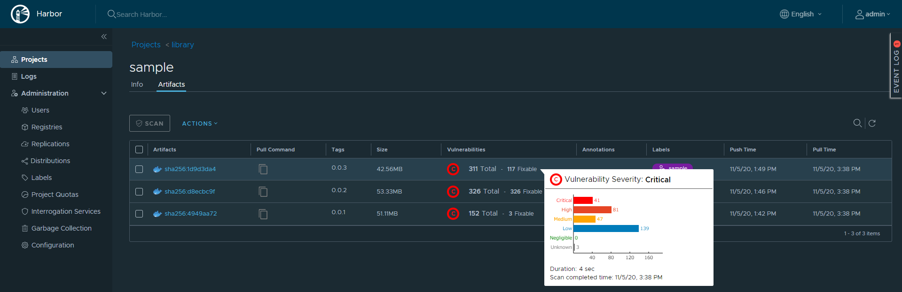
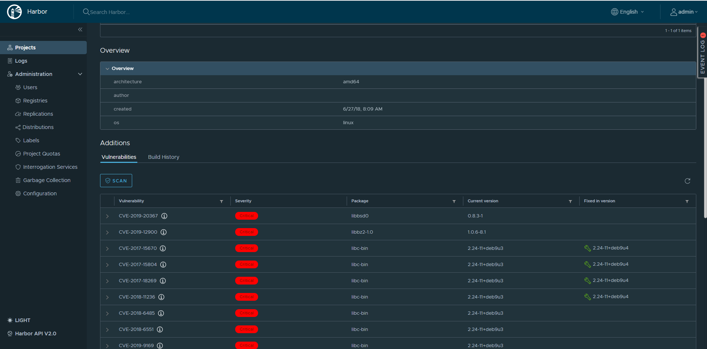

# Harbor

## 主な機能
* コンテナイメージの脆弱性チェック  
  * スキャナー  
オープンソースの2種類の脆弱性スキャンの利用をデフォルトでサポートしている。スキャン用のエンドポイントを登録することでスキャン方法を追加することができる。
    * [Trivy](https://github.com/aquasecurity/trivy)
    * [Clair](https://github.com/quay/clair)
  * スキャン方法  
    * push時にスキャン
    * 手動スキャン
    * スケジュールスキャン(hourly、daily、weekly、cron)  
  * Deployment Security  
    指定したセキュリティレベル(Critical、High、Mediamなど)の脆弱性が検知されない場合のみ公開するなどのセキュリティ設定が可能
  * CVE allowlist
    CVEホワイトリストを登録することが可能。
* registoryのレプリケーション  
Harborだけでなく、ECRやDockerHubなどへレプリケーション可能
* [ロールベースのアクセスコントール](https://goharbor.io/docs/2.1.0/administration/managing-users/)  
  あらかじめ用意されている５つのロールのいづれかをユーザーに割り当てる事でロールベースのアクセスコントロールができる。ロールの詳細については[リンク](https://goharbor.io/docs/2.1.0/administration/managing-users/)参照
  * Limited Guest
  * Guest
  * Developer
  * Maintainer
  * ProjectAdmin
* マルチテナント対応  
ユーザー/グループ/プロジェクト/ロールベースのアクセスコントロールによるマルチテナント対応
* 2P2ベース(Dragonfly、Kraken)のファイル分散配布
* Webhook
  slackや他のhttpのエンドポイントに通知可能

## スキャン結果サンプル

* Fixed in versionが表示されるので、現時点で対応可能な脆弱性なのか確認できる。
* Trivyで最新のNginxのDockerイメージをスキャンするとCritical×1、High×24、Mediam×12、Low×111検知される。

## 補足
簡易比較
|  機能  |  Harbor  |  DockerHub  |  ECR  | 補足 |
| ---- | ---- |---- |---- |---- |
| 有償・無償  |  無償  | 有償(Pro) | 有償 | |
| スキャナーの変更  | 可 | 不可 | 不可 | |
| fixedバージョンの表示  |  有  | 有 | 無 | |
| RBAC  | 有 | ? | 有 | |
| Deployment Security  | 有 | ? | 無 | |
| Webfook  | 有 | ? | 有(cloudwatch) | |

